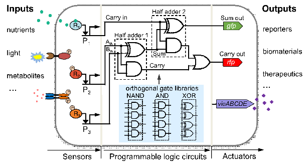
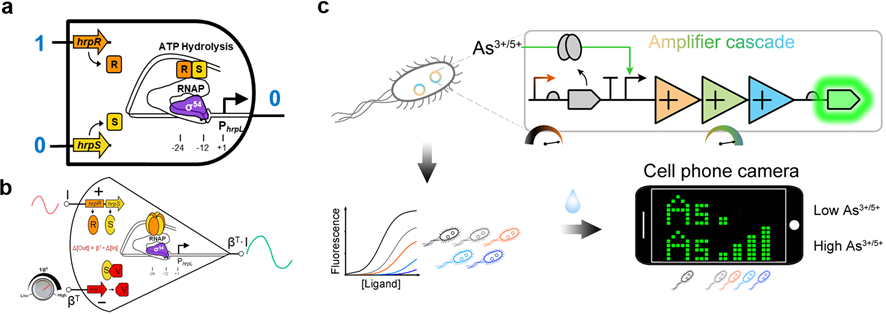
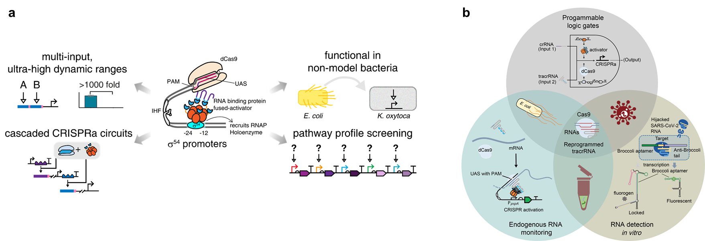

## 王宝俊
 
之江实验室生物计算研究中心特聘专家，浙江大学求是特聘教授，教育部长江学者讲席教授，浙江省鲲鹏行动计划专家。2022年回国任职前担任英国爱丁堡大学合成生物学终身教授。长期从事合成生物学使能技术开发、基因线路设计及其在生物计算、智能诊疗等领域的创新应用研究。近三年以通讯作者发表重要学术论文20余篇（包括Nature Chem Biol等7篇Nature子刊论文），担任PLOS Biology、ACS Synthetic Biology国际权威期刊学术编委，主持英国自然科学基金会、比尔盖茨基金会、美国海军研究署 、中国国家自然科学基金会等二十余项研究基金（总额逾亿元）。

### 荣誉及奖励
2022年  教育部“长江学者奖励计划”讲席学者

2022年  浙江省“鲲鹏行动”计划专家

2020年  英国皇家化学学会会士(FRSC)

2019年  英国自然科学基金会杰出青年科学基金奖(全英仅41人)

2016年  英国生物技术与科学基金会新研究员奖

2016年  英国维康基金会科学种子基金奖

2015年  比尔盖茨基金会全球大挑战探索基金奖

### 主要研究方向
1. 合成生物学使能技术与工具开发（内含肽、CRISPR基因编辑与调控等）
2. 细胞计算基因元器件的挖掘、改造、标准化及正交化设计
3. 生物计算基因线路设计（工程化、生物自动化设计等）
4. 生物计算、生物传感与智能诊疗应用

 
### 主要创新性科研成果
1.国际上率先提出生物计算基因线路的工程化创新设计方法：率先设计并构建了模块化与正交化的基因逻辑门控线路(Nature Commun 2011)、模块化的转录信号放大线路，创建了领域目前最敏感的基于微生物的砷和汞等重金属水污染细胞传感器（Nature Chem Biol 2019）；建立了基于核酸海绵的新型基因线路全面优化设计方法（Nature Commun 2020），开拓了生物计算基因线路在生物传感领域的创新应用。

 
代表论文：

Wan X, …, Wang B*, Nature Communications, 2020, 11, 5961 

Wan X, …, Wang B*, Nature Chemical Biology, 2019, 15(5), 540–548

Wang B et al, Nature Communications, 2011, 2, 508

2.国际上率先开发出新型“类真核”原核细菌CRISPRa基因激活技术（Nature Commun 2019）；揭示了II型CRISPR系统crRNA与tracrRNA匹配的可编程性机制(Nature Commun 2022)，并利用重编程tracrRNAs展示了其在生物计算与生物传感领域多个强大应用案例，包括发明了高特异性SARS-CoV-2新冠病毒RNA便携式快速传感器AGATHA。

 

代表论文与专利：

Liu Y, …, Wang B*, Nature Communications, 2022, 13, 1937

Liu Y, …, Wang B*, Nature Communications, 2019, 10, 3693

Wang B and Liu Y, Engineered CRISPRa, 国际专利PCT/GB2020/052031, 2019

3.国际上率先将内含肽与转座子工具结合开发了一种新型分裂蛋白设计定向进化方法IBM（Nature Commun 2021），并据此设计出了多种蛋白表达控制逻辑运算器件和显著降低蛋白本底表达水平的调控工具；开发了迄今规模最大的标准化正交断裂蛋白内含肽文库（Nature Commun 2020），解决了大分子高重复结构蛋白的体外精确无缝组装难题。

 
代表论文：

Ho T, …, Wang B*, Nature Communications, 2021, 12, 2200

Pinto F, …, Wang B*, Nature Communications, 2020, 11, 1529
