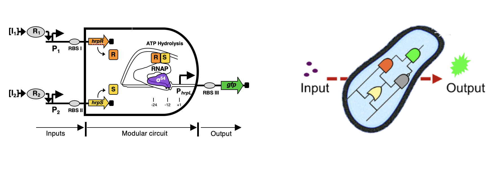
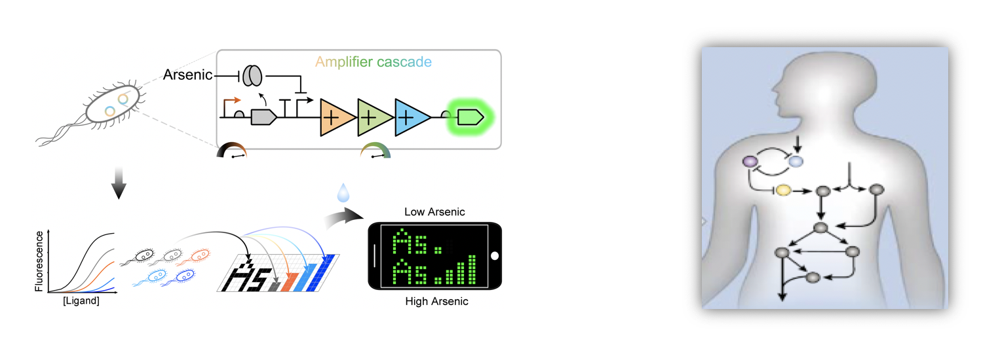

##### 生物线路设计实验室聚焦合成生物学领域核心科学问题和前沿技术挑战，主要在以下三个方向展开研究：
 

<!--  -->
 

#### 
（1）合成生物学关键共性使能技术及工具开发 

 

<!--  -->
 

#### 
（2）生物元器件与线路设计：工程化、智能化、生物自动化设计等 

 

<!--  -->
 

#### 
（3）生物传感、生物计算、智能诊疗及生物制造等领域的创新应用 

 

<!--  -->
 

