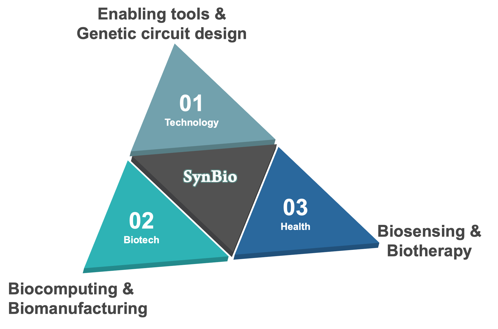

## Welcome to the Synthetic Biological Circuit Engineering Lab

Our research is primarily centered around Synthetic Biology, a fast growing discipline at the interface of biology, chemistry and engineering with significant expanding applications in diverse areas. Our interests include both fundamental and applied synthetic biology with focus on three synergistic research themes, i.e. the foundational technology, healthcare and industrial biotechnology applications. 

We use a bottom-up engineering approach to design synthetic biological circuits and systems using characterised/standardised biological parts and devices. We develop new enabling tools for synthetic biology, and build novel customised gene circuits for sensing and information processing of multiple cellular and environmental signals, with applications ranging from biosensing, biocomputing and biomanufacturing to biotherapy. 

<table>
<tr>
<td width="52%">

</td>
<td width="2%">
</td>
<td width="38%">

</td>
<td width="2%">
</td>
</tr>
</table>

<!--  -->
