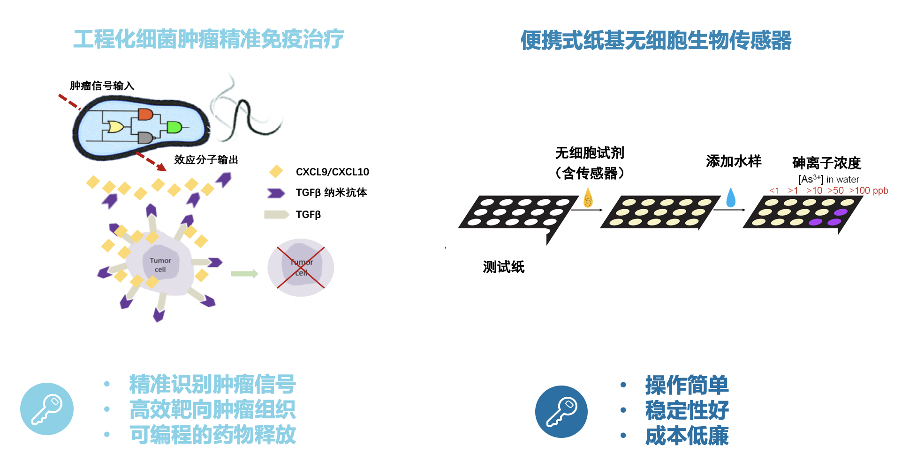
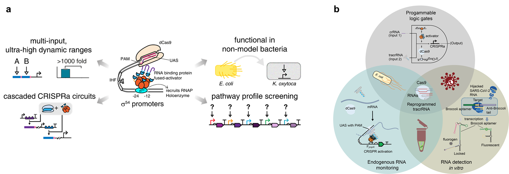
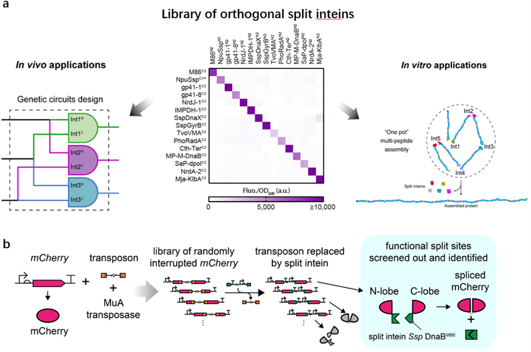

## 生物线路设计与创新实验室简介

实验室主要针对目前生物计算中仍存在的科学问题，提出改进方案及研究思路，主要包括合成生物使能技术工具开发和生物线路设计及创新应用研究三个方面：

 

 

**1. 合成生物学关键使能技术工具开发（内含肽、CRISPR基因调控等）**

通过开发新型基于内含子RNA自剪接的基因调控和线路设计工具，将传统的分层4输入与门设计改造成为基于内含子和内含肽的单层4输入与门，从而使得单个基因/蛋白信息处理能力提升6倍，这种方法具有载荷低、设计灵活，变革线路设计模式潜力。

**2. 基因元器件与基因线路的工程化、生物自动化设计**

将实验室研究产出的高质量正交合成元器件库和数理模型相结合，并辅以人工智能技术，从而开发出基因线路设计自动化软件平台，使基因线路的设计实现自动化，效率提升和规模升级，同时大幅度提高线路的可预测性。

**3. 生物线路在生物传感、生物计算与生物领域的创新应用**

设计产出的生物线路将应用于生命健康和环境监测。工程化细菌肿瘤精准免疫治疗，将实现精准识别肿瘤信号，高效靶向肿瘤组织和可编程的药物释放的效果。设计便携式纸基无细胞生物传感器，将在在成本低廉的条件下实现操作简单，稳定性高的效果。

<!-- ## 研究方向简介

王宝俊教授的研究方向为合成生物学和生物工程，主要包括合成生物学使能技术开发（CRISPR基因编辑与调控、基于内含肽的蛋白组装工具）、基因线路的工程化设计及在生物传感（环境污染、健康检测用便携传感器）、生物计算、生物治疗（肿瘤细菌疗法、人工噬菌体定向清除致病菌）和生物制造（生物功能材料合成、智能细胞工厂设计）等领域的创新应用。近几年，在合成生物学关键使能技术开发、基因线路设计及应用方向取得突破原创性成果，主要包括：（一）国际上率先提出基因线路的工程化设计方法，并开拓了其在超敏感生物传感、活体生物计算等领域的创新应用；（二）国际上率先开发出新型“类真核”原核细菌CRISPR基因激活技术，揭示了II型CRISPR系统crRNA与tracrRNA配对的可编程性机制并开拓了其在RNA生物传感领域的应用；（三）提出了新型分裂蛋白设计定向进化方法和创建了迄今为止规模最大的标准化正交断裂蛋白内含肽文库，解决了高重复结构大分子蛋白的体外精确无缝组装难题。近三年以通讯作者发表重要学术论文20余篇，包括Nature Chemical Biology 等6篇Nature子刊论文。

图1. 具有模块性和正交性的基因逻辑与门（a）和模拟转录信号放大器（b）的设计；

（c）基于多层级联转录信号放大基因线路的超敏感全细胞传感器的设计

 
 

图2.（a）细菌中的新型“类真核式”CRISPR基因激活调控系统的设计、性能和应用；

（b）可编程tracrRNA实现将非gRNA转变为gRNA及RNA检测应用

 
 

图3.（a）大规模正交断裂内含肽文库的建立（中）及在基因线路设计（左）和模块化蛋白组装中的应用（右）;

（b）基于内含肽与转座子结合的新型蛋白饱和断裂映射法流程图
 -->

